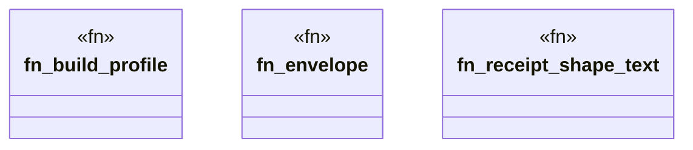

# `crates/praxis-graphlaw/tests/chatman_snapshot_semantics.rs`

Source SHA-256: `e46f7a915f90c4d4797a5a1bfe908cd458e3c4b41ab8587c0568c3e50d18fd97`

## Dependencies

- `chicago_tdd_tools::assert_matches`
- `chicago_tdd_tools::prelude::*`
- `chicago_tdd_tools::testing::snapshot::SnapshotAssert`
- `praxis_graphlaw::chatman::abi::{ GraphSnapshotId, InputHandles, InvocationEnvelope, InvocationId, OperatorId, ProfileId, Refusal, }`
- `praxis_graphlaw::chatman::engine::{AdmissionSpec, ChatmanEngine, EngineProfile}`
- `praxis_graphlaw::chatman::router::ProfileGates`
- `praxis_graphlaw::chatman::triple8::ProfileSymbolTable`

## Standing

- Structural parse: `ALIVE`
- Runtime behavior: `UNKNOWN`
