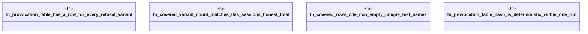

# `crates/praxis-graphlaw/tests/chatman_spec_theorems.rs`

Source SHA-256: `df407da4b09fc5bf13d6f4cb2c5d8c0340e0b82e6d9103352e43be9bde990fe6`

## Dependencies

- `chicago_tdd_tools::prelude::*`
- `praxis_graphlaw::chatman::abi::ALL_REFUSAL_NAMES`
- `std::collections::BTreeSet`

## Standing

- Structural parse: `ALIVE`
- Runtime behavior: `UNKNOWN`
