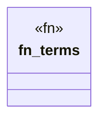

# `crates/praxis-graphlaw/tests/chatman_triple8_kernel.rs`

Source SHA-256: `f0000bef098a81c49e3b750592431fe5e6156f59338c9100bf633bba31cd36d0`

## Dependencies

- `chicago_tdd_tools::assert_matches`
- `chicago_tdd_tools::param_test`
- `chicago_tdd_tools::prelude::*`
- `praxis_graphlaw::chatman::abi::{ProfileId, Refusal}`
- `praxis_graphlaw::chatman::triple8::{ProfileSymbolTable, Term8}`

## Standing

- Structural parse: `ALIVE`
- Runtime behavior: `UNKNOWN`
