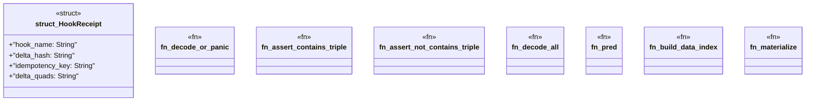

# `crates/praxis-graphlaw/tests/common/mod.rs`

Source SHA-256: `bf6bc9e0caca0cd8dd0a83e605dce7e2504772d89665bb3cf4d9910995104730`

## Dependencies

- `praxis_graphlaw::TripleStore`
- `praxis_graphlaw::parser::{Parser, Syntax}`
- `praxis_graphlaw::tripleindex::TripleIndex`
- `praxis_graphlaw::triples::Triple`

## Standing

- Structural parse: `ALIVE`
- Runtime behavior: `UNKNOWN`
