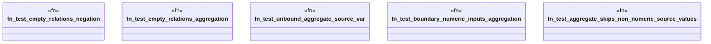

# `crates/praxis-graphlaw/tests/datalog_challenger.rs`

Source SHA-256: `a0cc2805f36a665eca9f235090cebd32c6361b88fdf58791e03438375e121a9d`

## Dependencies

- `praxis_graphlaw::TripleStore`
- `praxis_graphlaw::triples::{Aggregate, AggregateFunction, BodyLiteral, Rule, Triple}`

## Standing

- Structural parse: `ALIVE`
- Runtime behavior: `UNKNOWN`
