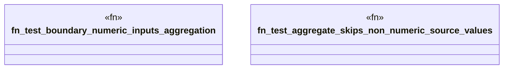

# `crates/praxis-graphlaw/tests/datalog_challenger_advanced.rs`

Source SHA-256: `7d6d99d8474b93a11faf5a36ca4598811eb235b8f752538a62bccbb27c0e6f78`

## Dependencies

- `praxis_graphlaw::TripleStore`
- `praxis_graphlaw::triples::{Aggregate, AggregateFunction, BodyLiteral, Rule, Triple}`

## Standing

- Structural parse: `ALIVE`
- Runtime behavior: `UNKNOWN`
