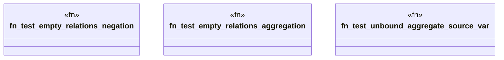

# `crates/praxis-graphlaw/tests/datalog_challenger_core.rs`

Source SHA-256: `5c2afe495745f78ec54b4fd0defe7058f4e648a12e6048733d658686cfa5f294`

## Dependencies

- `praxis_graphlaw::TripleStore`
- `praxis_graphlaw::triples::{Aggregate, AggregateFunction, BodyLiteral, Rule, Triple}`

## Standing

- Structural parse: `ALIVE`
- Runtime behavior: `UNKNOWN`
