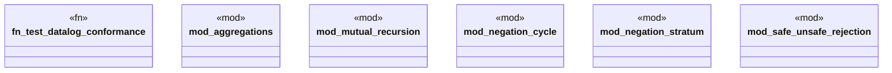

# `crates/praxis-graphlaw/tests/datalog_conformance.rs`

Source SHA-256: `45a63eaa4152f774d8fb9d9fb6275576c9ed05a5425b2dc2bcda9aac5e41e54e`

## Dependencies

- None observed.

## Standing

- Structural parse: `ALIVE`
- Runtime behavior: `UNKNOWN`
