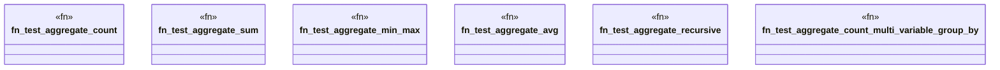

# `crates/praxis-graphlaw/tests/datalog_conformance/aggregations.rs`

Source SHA-256: `6b4c7fca8241ae6eda84e62b4298f9f44227741f31fb6603062a52e3f6e32339`

## Dependencies

- `praxis_graphlaw::TripleStore`
- `praxis_graphlaw::triples::{Aggregate, AggregateFunction, BodyLiteral, Rule, Triple}`

## Standing

- Structural parse: `ALIVE`
- Runtime behavior: `UNKNOWN`
