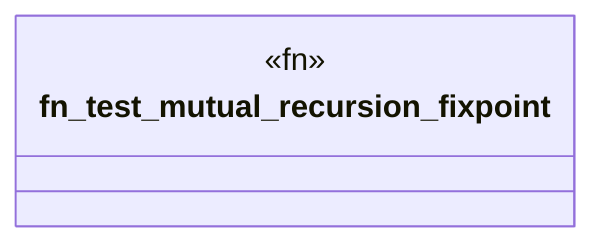

# `crates/praxis-graphlaw/tests/datalog_conformance/mutual_recursion.rs`

Source SHA-256: `b65e0a57578c2e0c3e58de47a8c2565be2081364e8db6f572ee6a32a906666ef`

## Dependencies

- `praxis_graphlaw::TripleStore`
- `praxis_graphlaw::triples::{BodyLiteral, Rule, Triple}`

## Standing

- Structural parse: `ALIVE`
- Runtime behavior: `UNKNOWN`
