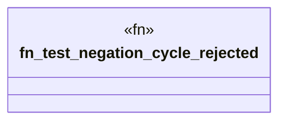

# `crates/praxis-graphlaw/tests/datalog_conformance/negation_cycle.rs`

Source SHA-256: `e5b5d276728b40dfecf32be306bac36ec09fbad6e5c36f0efe29b170d034de4a`

## Dependencies

- `praxis_graphlaw::TripleStore`
- `praxis_graphlaw::triples::{BodyLiteral, Rule, Triple}`

## Standing

- Structural parse: `ALIVE`
- Runtime behavior: `UNKNOWN`
