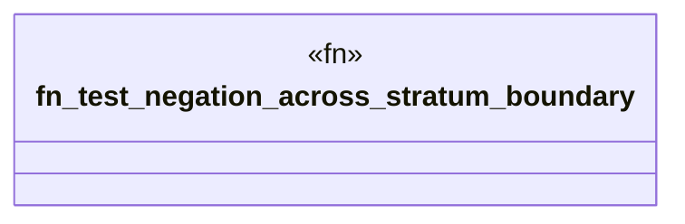

# `crates/praxis-graphlaw/tests/datalog_conformance/negation_stratum.rs`

Source SHA-256: `b42bb3083f1811f0375ea224763482d8fbf96b1358c7469339db24d4e81b279c`

## Dependencies

- `praxis_graphlaw::TripleStore`
- `praxis_graphlaw::triples::{BodyLiteral, Rule, Triple}`

## Standing

- Structural parse: `ALIVE`
- Runtime behavior: `UNKNOWN`
