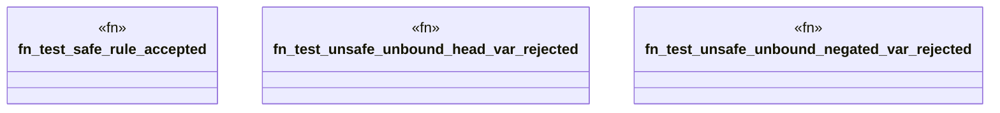

# `crates/praxis-graphlaw/tests/datalog_conformance/safe_unsafe_rejection.rs`

Source SHA-256: `7c2ba27d7df113c9a93fd98b6271adf642cbdb5f3a24e446324e88cb36ed0927`

## Dependencies

- `praxis_graphlaw::TripleStore`
- `praxis_graphlaw::triples::{BodyLiteral, Rule, Triple}`

## Standing

- Structural parse: `ALIVE`
- Runtime behavior: `UNKNOWN`
