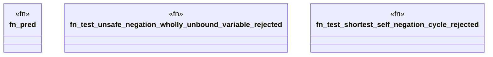

# `crates/praxis-graphlaw/tests/datalog_impossible.rs`

Source SHA-256: `efb5771c769e5c520f3fa5c23b29f5e9c6d66a94f80d9bf08254a8401f1d0b15`

## Dependencies

- `praxis_graphlaw::datalog::validate_rules`
- `praxis_graphlaw::triples::{BodyLiteral, Rule, Triple}`
- `std::collections::HashMap`

## Standing

- Structural parse: `ALIVE`
- Runtime behavior: `UNKNOWN`
