# `crates/praxis-graphlaw/tests/datalog_negation.rs`

Source SHA-256: `e0060ef610f0bcfc95938f82bb16cba1353bfebe7339bc8ef86131d1a7e68b81`

```mermaid
classDiagram
    class fn_test_stratified_negation_basic {
      <<fn>>
    }
    class fn_test_unstratifiable_rules_rejected {
      <<fn>>
    }
    class fn_test_rule_safety_check_rejects_unbound_negated_var {
      <<fn>>
    }
    class fn_test_fixpoint_terminates_on_recursive_ruleset {
      <<fn>>
    }
    class fn_test_negation_empty_relations {
      <<fn>>
    }
    class fn_test_negation_unbound_vars_rejected {
      <<fn>>
    }
    class fn_test_empty_body_rule {
      <<fn>>
    }
    class fn_test_long_unstratifiable_cycle_rejected {
      <<fn>>
    }
    class fn_test_three_layer_stratification_chain {
      <<fn>>
    }
    class fn_test_union_semantics_multiple_rules_same_head {
      <<fn>>
    }
```

## Dependencies

- `praxis_graphlaw::TripleStore`
- `praxis_graphlaw::datalog::validate_rules`
- `praxis_graphlaw::triples::{Aggregate, BodyLiteral, Rule, Triple}`
- `std::collections::HashMap`

## Standing

- Structural parse: `ALIVE`
- Runtime behavior: `UNKNOWN`
