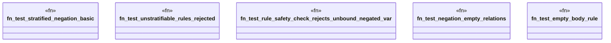

# `crates/praxis-graphlaw/tests/datalog_negation_basic.rs`

Source SHA-256: `7f101e2be9c7662731b2cbe079aa6be9c052a6403aabea51f882f47f99a66ddc`

## Dependencies

- `praxis_graphlaw::TripleStore`
- `praxis_graphlaw::triples::{BodyLiteral, Rule, Triple}`

## Standing

- Structural parse: `ALIVE`
- Runtime behavior: `UNKNOWN`
