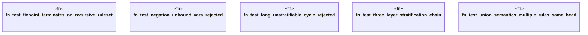

# `crates/praxis-graphlaw/tests/datalog_negation_stratification.rs`

Source SHA-256: `a1ca26c90e87bbe58dc7699ed4acb51e5cfeead96a226a25c2850d8415c48ca8`

## Dependencies

- `praxis_graphlaw::TripleStore`
- `praxis_graphlaw::datalog::validate_rules`
- `praxis_graphlaw::triples::{Aggregate, BodyLiteral, Rule, Triple}`
- `std::collections::HashMap`

## Standing

- Structural parse: `ALIVE`
- Runtime behavior: `UNKNOWN`
