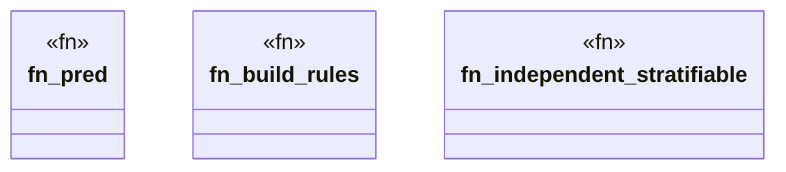

# `crates/praxis-graphlaw/tests/datalog_stratification_fuzz.rs`

Source SHA-256: `2baf67e5b690d43fe9f855b9ab9c54b549d463349c15980313300489ad499abe`

## Dependencies

- `praxis_graphlaw::datalog::validate_rules`
- `praxis_graphlaw::triples::{BodyLiteral, Rule, Triple}`
- `proptest::prelude::*`
- `std::collections::{HashMap, HashSet}`

## Standing

- Structural parse: `ALIVE`
- Runtime behavior: `UNKNOWN`
