# `crates/praxis-graphlaw/tests/datalog_stress.rs`

Source SHA-256: `e5fbf1b20a78d11c836446b81cd830aae5471a217b10d4e9e7eb28373cdd8720`

```mermaid
classDiagram
    class fn_decode_all {
      <<fn>>
    }
    class fn_pred {
      <<fn>>
    }
    class fn_test_deep_stratification_chain_20_layers {
      <<fn>>
    }
    class fn_test_deep_stratification_chain_with_far_cycle_rejected {
      <<fn>>
    }
    class fn_test_large_scale_grouped_aggregation {
      <<fn>>
    }
    class fn_test_diamond_reconvergence_rejected {
      <<fn>>
    }
    class fn_test_multiple_disjoint_cycles_rejected {
      <<fn>>
    }
    class fn_test_stratified_negation_over_aggregate_derived_predicate {
      <<fn>>
    }
```

## Dependencies

- `praxis_graphlaw::TripleStore`
- `praxis_graphlaw::datalog::validate_rules`
- `praxis_graphlaw::encoding::Encoder`
- `praxis_graphlaw::triples::{ Aggregate, AggregateFunction, BodyLiteral, Rule, Triple, VarOrTerm, }`
- `std::collections::HashMap`
- `std::time::{Duration, Instant}`

## Standing

- Structural parse: `ALIVE`
- Runtime behavior: `UNKNOWN`
