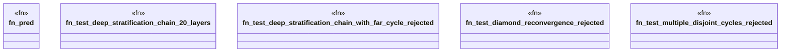

# `crates/praxis-graphlaw/tests/datalog_stress_recursion.rs`

Source SHA-256: `12fce07bb755e4f1c04868f4945ed3f4d54f9842e86fae239d9f83d0752a1e2b`

## Dependencies

- `praxis_graphlaw::TripleStore`
- `praxis_graphlaw::datalog::validate_rules`
- `praxis_graphlaw::triples::{BodyLiteral, Rule, Triple}`
- `std::collections::HashMap`
- `std::time::{Duration, Instant}`

## Standing

- Structural parse: `ALIVE`
- Runtime behavior: `UNKNOWN`
