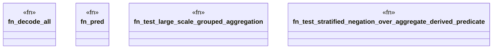

# `crates/praxis-graphlaw/tests/datalog_stress_scale.rs`

Source SHA-256: `baa9c42e1fc3c1fde3fe7d390f79aa68c2c4cfdbccde017f1dd102fc716913b2`

## Dependencies

- `praxis_graphlaw::TripleStore`
- `praxis_graphlaw::encoding::Encoder`
- `praxis_graphlaw::triples::{ Aggregate, AggregateFunction, BodyLiteral, Rule, Triple, VarOrTerm, }`
- `std::time::{Duration, Instant}`

## Standing

- Structural parse: `ALIVE`
- Runtime behavior: `UNKNOWN`
