# `crates/praxis-graphlaw/tests/dogfood_lifecycle_hook_actuation.rs`

Source SHA-256: `fce4eff23f3797d8dca1fe0b4cb229ee2c3957ea37360e5b1a9af48bb9945635`

```mermaid
classDiagram
    class mod_common {
      <<mod>>
    }
    class fn_materialized {
      <<fn>>
    }
    class fn_malformed_fixture_is_refused_at_load {
      <<fn>>
    }
    class fn_error_outcome_derives_no_obligation {
      <<fn>>
    }
    class fn_discharged_fixture_discharges_via_event_5 {
      <<fn>>
    }
    class fn_different_agent_ok_does_not_discharge {
      <<fn>>
    }
    class fn_cross_session_ok_neither_discharges_nor_escalates {
      <<fn>>
    }
    class fn_escalated_fixture_escalates_via_event_7_and_also_discharges {
      <<fn>>
    }
    class fn_not_yet_overdue_fixture_does_not_escalate {
      <<fn>>
    }
    class fn_gate_020_rows {
      <<fn>>
    }
    class fn_iri_collision_fixture_is_refused_by_the_single_valued_gate {
      <<fn>>
    }
    class fn_session_good_passes_the_single_valued_gate {
      <<fn>>
    }
    class fn_values_clause_is_refused_not_silent {
      <<fn>>
    }
```

## Dependencies

- `common::{assert_contains_triple, assert_not_contains_triple}`
- `oxigraph::io::RdfFormat`
- `oxigraph::sparql::{QueryResults, SparqlEvaluator}`
- `oxigraph::store::Store`
- `praxis_graphlaw::TripleStore`
- `praxis_graphlaw::parser::Syntax`

## Standing

- Structural parse: `ALIVE`
- Runtime behavior: `UNKNOWN`
