# `crates/praxis-graphlaw/tests/knowledge_hooks_e2e_tier3.rs`

Source SHA-256: `d41a043da8fa357e8c6b167606164259b201ee028292b861aa9e109f0ef00998`

```mermaid
classDiagram
    class mod_common {
      <<mod>>
    }
    class fn_test_c3_datalog_construct_delta_cascade {
      <<fn>>
    }
    class fn_test_c3_gating_construct_blake3_fixpoint {
      <<fn>>
    }
    class fn_test_c3_threshold_count_window_concurrency {
      <<fn>>
    }
    class fn_test_c3_n3_trigger_gating_valid {
      <<fn>>
    }
    class fn_test_c3_construct_empty_no_receipt {
      <<fn>>
    }
    class fn_test_c3_sparql_ask_construct_delete_early_termination {
      <<fn>>
    }
```

## Dependencies

- `common::assert_contains_triple`
- `common::assert_not_contains_triple`
- `praxis_graphlaw::TripleStore`
- `praxis_graphlaw::parser::Syntax`

## Standing

- Structural parse: `ALIVE`
- Runtime behavior: `UNKNOWN`
