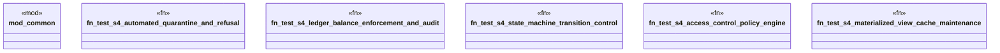

# `crates/praxis-graphlaw/tests/knowledge_hooks_e2e_tier4.rs`

Source SHA-256: `ec64b81535399d4ebc2131cae018f1ca92ed89c1256f63611e089c37335b68cb`

## Dependencies

- `common::assert_contains_triple`
- `common::assert_not_contains_triple`
- `praxis_graphlaw::TripleStore`
- `praxis_graphlaw::parser::Syntax`

## Standing

- Structural parse: `ALIVE`
- Runtime behavior: `UNKNOWN`
