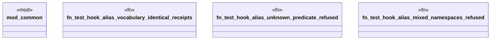

# `crates/praxis-graphlaw/tests/knowledge_hooks_e2e_tier5.rs`

Source SHA-256: `804852a672f927af9d52608e9cb0a5dbbb45625d747515815cf9d86fdee0930f`

## Dependencies

- `praxis_graphlaw::TripleStore`
- `praxis_graphlaw::parser::Syntax`

## Standing

- Structural parse: `ALIVE`
- Runtime behavior: `UNKNOWN`
