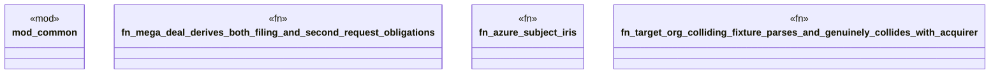

# `crates/praxis-graphlaw/tests/ma_case_adversarial_fixtures.rs`

Source SHA-256: `5422fa1338f1cdc7052ecfb0dbe5a0abe6b29d7e2a810e876283ba563d87cb59`

## Dependencies

- `common::assert_contains_triple`
- `praxis_graphlaw::TripleStore`
- `praxis_graphlaw::parser::Syntax`

## Standing

- Structural parse: `ALIVE`
- Runtime behavior: `UNKNOWN`
