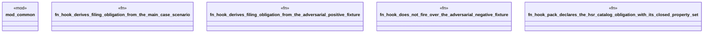

# `crates/praxis-graphlaw/tests/ma_case_hook_actuation.rs`

Source SHA-256: `c3279cac318d3fbf9e24d3b7b453ffa83131f64ba3f5323b6e7a506343362090`

## Dependencies

- `common::{assert_contains_triple, assert_not_contains_triple}`
- `praxis_graphlaw::TripleStore`
- `praxis_graphlaw::parser::Syntax`

## Standing

- Structural parse: `ALIVE`
- Runtime behavior: `UNKNOWN`
