# `crates/praxis-graphlaw/tests/ma_case_study_competency_questions.rs`

Source SHA-256: `2c924c4237e097f5b42f1620e1ca1f853a27c680f7368e6ce5a962d111030e2a`

```mermaid
classDiagram
    class mod_common {
      <<mod>>
    }
    class fn_run {
      <<fn>>
    }
    class fn_val {
      <<fn>>
    }
    class fn_iri {
      <<fn>>
    }
    class fn_literal_lexical {
      <<fn>>
    }
    class fn_cq2_1_ownership_percentage_against_main_case {
      <<fn>>
    }
    class fn_cq3_1_open_due_diligence_items_against_main_case {
      <<fn>>
    }
    class fn_cq3_2_waived_due_diligence_items_against_main_case {
      <<fn>>
    }
    class fn_cq3_2_waived_due_diligence_items_against_second_independent_case_is_empty {
      <<fn>>
    }
    class fn_cq7_1_vote_outcome_and_quorum_against_main_case {
      <<fn>>
    }
    class fn_cq7_1_vote_outcome_and_quorum_against_second_independent_case {
      <<fn>>
    }
```

## Dependencies

- `praxis_graphlaw::TripleStore`
- `praxis_graphlaw::parser::Syntax`
- `praxis_graphlaw::sparql::Binding`

## Standing

- Structural parse: `ALIVE`
- Runtime behavior: `UNKNOWN`
