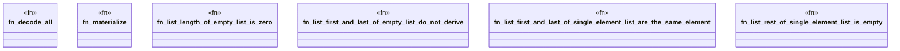

# `crates/praxis-graphlaw/tests/n3_builtin_adversarial_list.rs`

Source SHA-256: `502273c8f7daf0cd912a7e8732afcd2267c8406739a8b75ccbe304545c14ea59`

## Dependencies

- `praxis_graphlaw::TripleStore`
- `proptest::prelude::*`

## Standing

- Structural parse: `ALIVE`
- Runtime behavior: `UNKNOWN`
