# `crates/praxis-graphlaw/tests/n3_builtin_adversarial_log.rs`

Source SHA-256: `8cab28fdc9b507f99bfe76cc57a79ff0253cd5d83fc12f5ab36f410c09d363d1`

```mermaid
classDiagram
    class fn_decode_all {
      <<fn>>
    }
    class fn_materialize {
      <<fn>>
    }
    class fn_log_equal_to_literal_vs_iri_are_not_equal {
      <<fn>>
    }
    class fn_log_equal_to_iri_vs_blank_node_are_not_equal {
      <<fn>>
    }
    class fn_log_equal_to_literal_vs_blank_node_are_not_equal {
      <<fn>>
    }
    class fn_log_equal_to_same_iri_is_equal {
      <<fn>>
    }
    class fn_log_equal_to_numeric_literals_different_lexical_same_value_are_equal {
      <<fn>>
    }
    class fn_log_bound_on_genuinely_unbound_variable_never_fires {
      <<fn>>
    }
    class fn_log_bound_on_a_bound_variable_fires {
      <<fn>>
    }
```

## Dependencies

- `praxis_graphlaw::TripleStore`

## Standing

- Structural parse: `ALIVE`
- Runtime behavior: `UNKNOWN`
