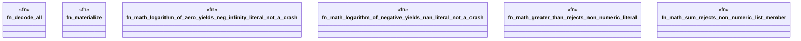

# `crates/praxis-graphlaw/tests/n3_builtin_adversarial_math.rs`

Source SHA-256: `3377547aedca92f5e72306037d1e7dee81cc1a1fec1ea50b2c060a62819485c8`

## Dependencies

- `praxis_graphlaw::TripleStore`
- `proptest::prelude::*`

## Standing

- Structural parse: `ALIVE`
- Runtime behavior: `UNKNOWN`
