# `crates/praxis-graphlaw/tests/n3_builtin_adversarial_string.rs`

Source SHA-256: `80798c5cf07750946b210cb4155131db8596b55a59f3b959cf3070b5b6798f2a`

```mermaid
classDiagram
    class fn_decode_all {
      <<fn>>
    }
    class fn_materialize {
      <<fn>>
    }
    class fn_string_length_of_empty_string_is_zero {
      <<fn>>
    }
    class fn_string_concat_preserves_unicode {
      <<fn>>
    }
    class fn_string_matches_invalid_regex_fails_closed_no_panic {
      <<fn>>
    }
    class fn_string_not_matches_invalid_regex_fails_closed_no_panic {
      <<fn>>
    }
    class fn_string_contains_ignoring_case_boundary {
      <<fn>>
    }
```

## Dependencies

- `praxis_graphlaw::TripleStore`
- `proptest::prelude::*`

## Standing

- Structural parse: `ALIVE`
- Runtime behavior: `UNKNOWN`
