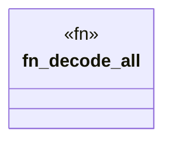

# `crates/praxis-graphlaw/tests/n3_builtin_combinatorics.rs`

Source SHA-256: `de91722d284248e1dce8134557e11232f50df6302f508057d193a21e2e28fd04`

## Dependencies

- `praxis_graphlaw::TripleStore`
- `proptest::prelude::*`

## Standing

- Structural parse: `ALIVE`
- Runtime behavior: `UNKNOWN`
