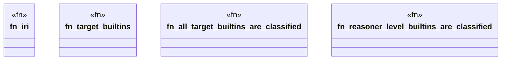

# `crates/praxis-graphlaw/tests/n3_builtin_coverage.rs`

Source SHA-256: `7df1f38e52afc64bf3605bb4149f89ab5d4adcba3b6f9750fa7dc542ea2daffe`

## Dependencies

- `praxis_graphlaw::builtins::classify`
- `praxis_graphlaw::term::VarOrTerm`

## Standing

- Structural parse: `ALIVE`
- Runtime behavior: `UNKNOWN`
