# `crates/praxis-graphlaw/tests/n3_builtins.rs`

Source SHA-256: `d4c913ab4197d12d8a62a273d72e3e8a18cfc00775c8b8b4126899477dd54588`

```mermaid
classDiagram
    class fn_decode_all {
      <<fn>>
    }
    class fn_test_log_builtin_equal_to {
      <<fn>>
    }
    class fn_test_log_builtin_implies {
      <<fn>>
    }
    class fn_test_math_builtin_sum {
      <<fn>>
    }
    class fn_test_math_builtin_greater_than {
      <<fn>>
    }
    class fn_test_list_builtin_in {
      <<fn>>
    }
    class fn_test_list_builtin_length {
      <<fn>>
    }
    class fn_test_string_builtin_concat {
      <<fn>>
    }
    class fn_test_string_builtin_length {
      <<fn>>
    }
    class fn_test_math_builtins_difference_product_quotient_remainder {
      <<fn>>
    }
    class fn_test_math_builtins_comparison_constraints {
      <<fn>>
    }
    class fn_test_log_builtin_not_equal_to {
      <<fn>>
    }
    class fn_test_list_builtin_append {
      <<fn>>
    }
```

## Dependencies

- `praxis_graphlaw::TripleStore`

## Standing

- Structural parse: `ALIVE`
- Runtime behavior: `UNKNOWN`
