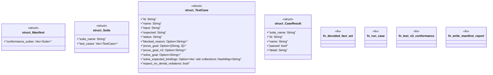

# `crates/praxis-graphlaw/tests/n3_conformance/main.rs`

Source SHA-256: `103389a815b5d6edf4e99999e3fa0caf14d8b8a4512d4ba18986c7db4e5ef1ba`

## Dependencies

- `praxis_graphlaw::TripleStore`
- `serde::Deserialize`
- `std::collections::HashSet`
- `std::fs`
- `std::path::{Path, PathBuf}`

## Standing

- Structural parse: `ALIVE`
- Runtime behavior: `UNKNOWN`
