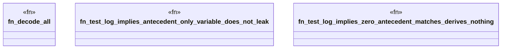

# `crates/praxis-graphlaw/tests/n3_implies_fuzz.rs`

Source SHA-256: `fbc3deaaed37dbd8cb759b63644f1dfa7ecf869a12db11b128bb41337f729058`

## Dependencies

- `praxis_graphlaw::TripleStore`
- `proptest::prelude::*`

## Standing

- Structural parse: `ALIVE`
- Runtime behavior: `UNKNOWN`
