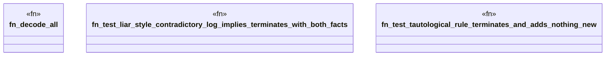

# `crates/praxis-graphlaw/tests/n3_impossible.rs`

Source SHA-256: `29f575c75e01db2243986865bee85a3d1725d30873400e4a3d87552061577ed0`

## Dependencies

- `praxis_graphlaw::TripleStore`
- `proptest::prelude::*`
- `std::time::{Duration, Instant}`

## Standing

- Structural parse: `ALIVE`
- Runtime behavior: `UNKNOWN`
