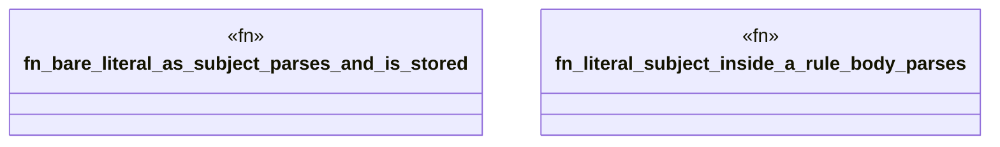

# `crates/praxis-graphlaw/tests/n3_literal_as_subject.rs`

Source SHA-256: `02bac64c5761bf3e77943dd3006abe5743f49d77a4874481ecc52027a583da13`

## Dependencies

- `praxis_graphlaw::TripleStore`

## Standing

- Structural parse: `ALIVE`
- Runtime behavior: `UNKNOWN`
