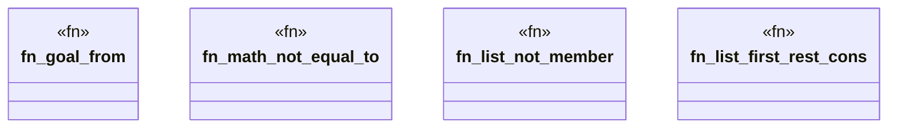

# `crates/praxis-graphlaw/tests/n3_new_builtins.rs`

Source SHA-256: `80ad41567ad77d842268cb5ce04f56998228c83e9af30c6ef4f65addaebbe77d`

## Dependencies

- `praxis_graphlaw::TripleStore`

## Standing

- Structural parse: `ALIVE`
- Runtime behavior: `UNKNOWN`
