# `crates/praxis-graphlaw/tests/n3_parser.rs`

Source SHA-256: `3eb601c4a21aad3327ea0a75b186e56725da0df1406b7aae7c8df5799f23ebc7`

```mermaid
classDiagram
    class fn_test_parse_multi_triple_head {
      <<fn>>
    }
    class fn_test_parse_literal_terms {
      <<fn>>
    }
    class fn_test_parse_blank_nodes {
      <<fn>>
    }
    class fn_test_parse_lists {
      <<fn>>
    }
    class fn_test_parse_quantifiers {
      <<fn>>
    }
    class fn_test_parse_quoted_graphs {
      <<fn>>
    }
    class fn_test_parse_backward_implication {
      <<fn>>
    }
    class fn_test_parse_comments_ignored {
      <<fn>>
    }
    class fn_test_parse_error_returns_result_not_panic {
      <<fn>>
    }
```

## Dependencies

- `praxis_graphlaw::parser::Parser`

## Standing

- Structural parse: `ALIVE`
- Runtime behavior: `UNKNOWN`
