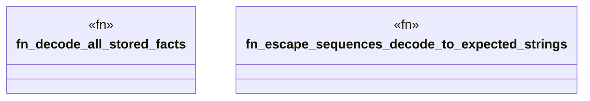

# `crates/praxis-graphlaw/tests/n3_parser_roundtrip_fuzz.rs`

Source SHA-256: `147f685313eaeee6054eae8f070ef04178ebcea76491c24fcad7cc74ad68feaf`

## Dependencies

- `praxis_graphlaw::TripleStore`
- `proptest::prelude::*`
- `std::collections::HashSet`

## Standing

- Structural parse: `ALIVE`
- Runtime behavior: `UNKNOWN`
