# `crates/praxis-graphlaw/tests/n3_scoping.rs`

Source SHA-256: `7508b827d1bb77a77e8aedbc9791c96e52767ad3e2815a0208366b4c9eccaf8c`

```mermaid
classDiagram
    class fn_decode_all {
      <<fn>>
    }
    class fn_decode_all_stored_facts {
      <<fn>>
    }
    class fn_test_nested_quoted_formula_does_not_leak_into_facts {
      <<fn>>
    }
    class fn_test_chained_implication_across_two_distinct_rules {
      <<fn>>
    }
    class fn_test_chained_implication_through_log_implies_then_ordinary_rule {
      <<fn>>
    }
    class fn_test_chained_log_implies_through_two_independent_implies_rules {
      <<fn>>
    }
    class fn_test_forsome_skolemizes_to_same_blank_node_within_one_scope {
      <<fn>>
    }
    class fn_test_forsome_skolems_are_fresh_across_independent_documents {
      <<fn>>
    }
    class fn_test_forall_in_sibling_formulas_does_not_collide {
      <<fn>>
    }
    class fn_test_forall_declared_inside_rule_antecedent_braces_parses_and_scopes {
      <<fn>>
    }
    class fn_test_two_independent_log_implies_literals_in_one_rule_body {
      <<fn>>
    }
```

## Dependencies

- `praxis_graphlaw::TripleStore`
- `praxis_graphlaw::parser::Parser`
- `praxis_graphlaw::term::VarOrTerm`

## Standing

- Structural parse: `ALIVE`
- Runtime behavior: `UNKNOWN`
