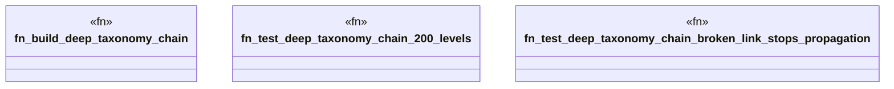

# `crates/praxis-graphlaw/tests/n3_stress.rs`

Source SHA-256: `b6f1480154e9ad0611c33933bca99993795fa1dbffca8acd019b2979d768fe0f`

## Dependencies

- `praxis_graphlaw::TripleStore`
- `std::time::{Duration, Instant}`

## Standing

- Structural parse: `ALIVE`
- Runtime behavior: `UNKNOWN`
