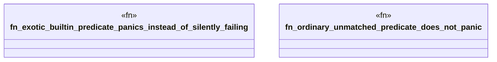

# `crates/praxis-graphlaw/tests/n3_unsupported_builtin_guard.rs`

Source SHA-256: `fdf5ba05d011899249f9837d32842ed0117b4e563309c0b4e5e3da2f7b2f378a`

## Dependencies

- `praxis_graphlaw::TripleStore`
- `std::panic`

## Standing

- Structural parse: `ALIVE`
- Runtime behavior: `UNKNOWN`
