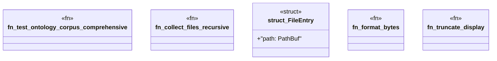

# `crates/praxis-graphlaw/tests/ontology_corpus_test.rs`

Source SHA-256: `e756d8cb3ff2b1dd02462c897761fefb2821fe321852276c07152aa2fc5ef22c`

## Dependencies

- `praxis_graphlaw::parser::{Parser, Syntax}`
- `std::fs`
- `std::path::PathBuf`

## Standing

- Structural parse: `ALIVE`
- Runtime behavior: `UNKNOWN`
