# `crates/praxis-graphlaw/tests/oxrdf_adapter.rs`

Source SHA-256: `dfe6da27036f171a3cc785e720173c0b37ac7a76183af60e9a4c66586946d76a`

```mermaid
classDiagram
    class fn_test_triple_index_to_oxrdf_graph_roundtrip {
      <<fn>>
    }
    class fn_test_literal_datatype_langtag_preserved_across_adapter {
      <<fn>>
    }
    class fn_test_blank_node_identity_preserved {
      <<fn>>
    }
    class fn_test_oxrdf_adapter_robustness {
      <<fn>>
    }
    class fn_test_literal_lang_roundtrip_equality {
      <<fn>>
    }
    class fn_test_simple_literal_roundtrip_equality {
      <<fn>>
    }
    class fn_test_xsd_decimal_boolean_date_roundtrip_equality {
      <<fn>>
    }
```

## Dependencies

- `oxrdf::{Literal, NamedNode, NamedOrBlankNode, NamedOrBlankNodeRef, Term, TermRef}`
- `praxis_graphlaw::oxrdf_adapter::oxrdf_term_to_roxi_term`
- `praxis_graphlaw::oxrdf_adapter::{oxrdf_term_to_roxi_term, triple_index_to_oxrdf_graph}`
- `praxis_graphlaw::tripleindex::TripleIndex`
- `praxis_graphlaw::triples::Term as RoxiTerm`
- `praxis_graphlaw::triples::{Triple, VarOrTerm}`

## Standing

- Structural parse: `ALIVE`
- Runtime behavior: `UNKNOWN`
