# `crates/praxis-graphlaw/tests/pattern4_equivalence_canonicalization.rs`

Source SHA-256: `d66fd20c55c3bc3894b4abc4658cd9504b17d4838b154d284ba5ff15c8c67fd0`

```mermaid
classDiagram
    class fn_make_triple {
      <<fn>>
    }
    class fn_test_pattern4_empty_equivalences {
      <<fn>>
    }
    class fn_test_pattern4_same_as_equivalence {
      <<fn>>
    }
    class fn_test_pattern4_equivalent_class_equivalence {
      <<fn>>
    }
    class fn_test_pattern4_equivalent_property_equivalence {
      <<fn>>
    }
    class fn_test_pattern4_canonical_edges_sorted {
      <<fn>>
    }
    class fn_test_pattern4_transitive_equivalence {
      <<fn>>
    }
    class fn_test_pattern4_determinism_five_runs {
      <<fn>>
    }
    class fn_test_pattern4_integration_with_validator {
      <<fn>>
    }
```

## Dependencies

- `praxis_graphlaw::encoding::Encoder`
- `praxis_graphlaw::shacl::{ canonicalize_equivalences, render_all_equivalences_canonical, Validator, }`
- `praxis_graphlaw::tripleindex::TripleIndex`
- `praxis_graphlaw::triples::{Triple, VarOrTerm}`

## Standing

- Structural parse: `ALIVE`
- Runtime behavior: `UNKNOWN`
