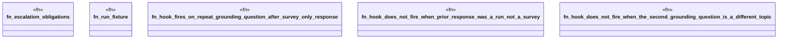

# `crates/praxis-graphlaw/tests/self_monitoring_hook_actuation.rs`

Source SHA-256: `817c4d5349ae921cbbd511d4fdfbf39c9613cb6e970f4c813072c61680279fe7`

## Dependencies

- `praxis_graphlaw::TripleStore`
- `praxis_graphlaw::parser::Syntax`

## Standing

- Structural parse: `ALIVE`
- Runtime behavior: `UNKNOWN`
