# `crates/praxis-graphlaw/tests/self_monitoring_lifecycle_fixtures.rs`

Source SHA-256: `3839752881a49a4e5585f808290154469fc99eea0cb9aab09d0a6c39b09c7ce4`

```mermaid
classDiagram
    class mod_common {
      <<mod>>
    }
    class fn_run_fixture {
      <<fn>>
    }
    class fn_overdue_fixture_derives_an_overdue_escalation_through_the_hook_mechanism {
      <<fn>>
    }
    class fn_ungoverned_fixture_flags_exactly_one_ungoverned_transition_and_no_escalation {
      <<fn>>
    }
    class fn_open_obligation_rows {
      <<fn>>
    }
    class fn_discharged_example_yields_zero_open_obligations_and_status_flip_is_the_control {
      <<fn>>
    }
```

## Dependencies

- `common::{assert_contains_triple, assert_not_contains_triple}`
- `praxis_graphlaw::TripleStore`
- `praxis_graphlaw::parser::Syntax`

## Standing

- Structural parse: `ALIVE`
- Runtime behavior: `UNKNOWN`
